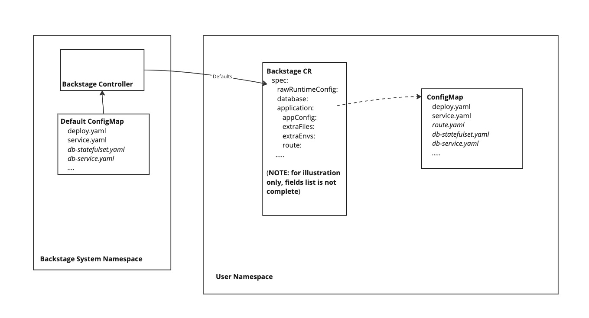

# Configuration

It is highly recommended to read the [Design](design.md) document to understand the components that make up Backstage.

The Backstage Operator supports three configuration levels: Default, Raw, and Custom Resource Config.

## Default Configuration
  
The Default Configuration defines the structure of all Backstage instances within a cluster. It consists of a set of YAML manifests that define Kubernetes resources for a Backstage instance. This configuration is located in the `*-default-config` ConfigMap in the Backstage operator namespace (usually called **backstage-system** or **backstage-operator**) and mounted to the `/default-config` directory of the Backstage controller container.



### Default Configuration Files

| Key/File Name        | Object Kind                    | Object Name                                | Mandatory    | Multi | Version | Notes                                           |
|----------------------|--------------------------------|--------------------------------------------|--------------|-------|---------|-------------------------------------------------|
| deployment.yaml      | appsv1.Deployment              | backstage-<cr-name>                        | Yes          | No    | >=0.1.x | Backstage deployment                            |
| service.yaml         | corev1.Service                 | backstage-<cr-name>                        | Yes          | No    | >=0.1.x | Backstage Service                               |
| db-statefulset.yaml  | appsv1.StatefulSet             | backstage-psql-<cr-name>                   | For local DB | No    | >=0.1.x | PostgreSQL StatefulSet                          |
| db-service.yaml      | corev1.Service                 | backstage-psql-<cr-name>                   | For local DB | No    | >=0.1.x | PostgreSQL Service                              |
| db-secret.yaml       | corev1.Secret                  | backstage-psql-secret-<cr-name>            | For local DB | No    | >=0.1.x | Secret to connect Backstage to PGSQL            |
| route.yaml           | openshift.Route                | backstage-<cr-name>                        | No (for OCP) | No    | >=0.1.x | Route exposing Backstage service                |
| app-config.yaml      | corev1.ConfigMap               | backstage-appconfig-<cr-name>              | No           | No    | >=0.2.x | Backstage app-config.yaml                       |
| configmap-files.yaml | corev1.ConfigMap               | backstage-files-<cr-name>                  | No           | No    | >=0.2.x | Backstage config file inclusions from configMap |
| configmap-envs.yaml  | corev1.ConfigMap               | backstage-envs-<cr-name>                   | No           | No    | >=0.2.x | Backstage environment variables from ConfigMap  |
| secret-files.yaml    | []corev1.Secret                | backstage-files-<cr-name>                  | No           | Yes   | >=0.2.x | Backstage config file inclusions from Secret    |
| secret-envs.yaml     | []corev1.Secret                | backstage-envs-<cr-name>                   | No           | Yes   | >=0.2.x | Backstage environment variables from Secret     |
| dynamic-plugins.yaml | corev1.ConfigMap               | backstage-dynamic-plugins-<cr-name>        | No           | No    | >=0.2.x | Dynamic plugins configuration                   |
| pvcs.yaml            | []corev1.PersistentVolumeClaim | backstage-&lt;cr-name&gt;-&lt;pvc-name&gt; | No           | Yes   | >=0.4.x | List of PVC objects to be mounted to containers |

**Meanings of "Mandatory" Column:**
- **Yes** - Must be configured; deployment will fail otherwise.
- **For local DB** - Has to be configured if `spec.enableLocalDb` is `true` (or unset) in the Backstage CR.
- **No** - Optional configuration.
- **No (for OCP)** - Optional configuration, working in Openshift only.
  
You can see examples of default configurations as part of the [Operator Profiles](../config/profile) in the **default-config** directory.

### Default mount path

Some objects, such as: app-config, configmap-files, secret-files, dynamic-plugins, pvcs, are mounted to the Backstage Container as files or directories. Default mount path is Container's WorkingDir, if not defined it falls to "/opt/app-root/src". 

### Annotations

We use annotations to configure some objects. The following annotations are supported:

#### rhdh.redhat.com/mount-path to configure mount path.

If specified, the object will be mounted to the specified path, otherwise [Default mount path](#default-mount-path) will ve used. 
It is possible to specify relative path, which will be appended to the default mount path.

Supported objects: **pvcs, secret-files**.

Examples:

_**pvcs.yaml**_
```yaml
apiVersion: v1
kind: PersistentVolumeClaim
metadata:
  name: myclaim
  annotations:
    rhdh.redhat.com/mount-path: /mount/path/from/annotation
...
```
  
In the example above the PVC called **myclaim** will be mounted to **/mount/path/from/annotation** directory

_**secret-files.yaml**_
```yaml
apiVersion: v1
kind: Secret
metadata:
  name: mysecret
  annotations:
    rhdh.redhat.com/mount-path: /mount/path/from/annotation
...
```
In the example above the Secret called **mysecret** will be mounted to **/mount/path/from/annotation** directory

#### rhdh.redhat.com/containers for mounting volume to specific container(s)

Supported objects: **pvcs, secret-files, secret-envs**.

Options:

* No or empty annotation: the volume will be mounted to the Backstage container only
* \* (asterisk): the volume will be mounted to all the containers
* Otherwise, container names separated by commas will be used

Examples:

_**pvcs.yaml**_
```yaml
apiVersion: v1
kind: PersistentVolumeClaim
metadata:
  name: myclaim
  annotations:
    rhdh.redhat.com/containers: "init-dynamic-plugins,backstage-backend"
...
```
In the example above the PVC called **myclaim** will be mounted to **init-dynamic-plugins** and **backstage-backend** containers

_**secret-envs.yaml**_

```yaml
apiVersion: v1
kind: Secret
metadata:
  name: mysecret
  annotations:
    rhdh.redhat.com/containers: "*"
...
```
In the example above the PVC called **myclaim** will be mounted to all the containers

### Metadata Generation
  
For Backstage to function consistently at runtime, certain metadata values need to be predictable. Therefore, the Operator generates values according to the following rules. Any value for these fields specified in either Default or Raw Configuration will be replaced by the generated values.

For All the objects **metadata.name** is generated according to the rules defined in the [Default Configuration files](#default-configuration-files), column **Object name**. <cr-name> means a Name of Backstage Custom Resource owning this configuration.
For example, Backstage CR named **mybackstage** will create K8s Deployment resource called **backstage-mybackstage**. Specific, per-object generated metadata described below.

* deployment.yaml
    - `spec.selector.matchLabels[rhdh.redhat.com/app] = backstage-<cr-name>`
    - `spec.template.metadata.labels[rhdh.redhat.com/app] = backstage-<cr-name>`
* service.yaml
    - `spec.selector[rhdh.redhat.com/app] = backstage-<cr-name>`
* db-statefulset.yaml
    - `spec.selector.matchLabels[rhdh.redhat.com/app] = backstage-psql-<cr-name>`
    - `spec.template.metadata.labels[rhdh.redhat.com/app] = backstage-psql-<cr-name>`
* db-service.yaml
    - `spec.selector[rhdh.redhat.com/app] = backstage-psql-<cr-name>`

### Multi objects

Since version **0.4.0**, Operator supports multi objects which mean the object type(s) marked as Multi=true in the table above can be declared and added to the model as the list of objects of certain type. To do so multiple objects are added to the yaml file using "---" delimiter.

For example, adding the following code snip to **pvcs.yaml** will cause creating 2 PVCs called **backstage-&lt;cr-name&gt;-myclaim1** and **backstage-&lt;cr-name&gt;-myclaim2** and mounting them to Backstage container accordingly. 

```yaml
apiVersion: v1
kind: PersistentVolumeClaim
metadata:
  name: myclaim1
...
---
apiVersion: v1
kind: PersistentVolumeClaim
metadata:
  name: myclaim2
...
```

## Raw Configuration

Raw Configuration consists of the same YAML manifests as the Default configuration, but is specific to each Custom Resource (CR). You can override any or all Default configuration keys (e.g., for `deployment.yaml`) or add new keys not defined in the Default configuration by specifying them in ConfigMaps.

Here’s a fragment of the Backstage spec containing Raw configuration:

```yaml
spec:
  rawRuntimeConfig:
    backstageConfig: <configMap-name>  # to use for all manifests except db-*.yaml
    localDbConfig: <configMap-name>    # to use for db-*.yaml manifests
```

**NOTE:** While the Backstage Application config is separated from Database Configuration, it makes no difference which ConfigMap you use for which object; they are ultimately merged into one structure. Just avoid using the same keys in both.

## Custom Resource Spec

The desired state of resources created by the Backstage Operator is defined in the Backstage Custom Resource Spec. Here’s an example of a simple Backstage CR:

```yaml
apiVersion: rhdh.redhat.com/v1alpha3
kind: Backstage
metadata:
  name: mybackstage
spec:
  application:
    appConfig:
      configMaps:
        - name: my-app-config
    extraEnvs:
      secrets:
        - name: my-secrets
```

This Custom Resource defines a Backstage instance called **mybackstage** and also:
- Adds additional app-config stored in the **my-app-config** ConfigMap.
- Adds some extra environment variables stored (as key-value pairs) in the Secret called **my-secrets**.

For API version **v1alpha2** (Operator version **0.3.x**), the Backstage CR Spec contains the following top-level elements:

* [application](#application-configuration)
* [deployment](#deployment-configuration)
* [database](#database-configuration)
* [rawRuntimeConfig](#raw-configuration)
  
### Application Configuration

This section explains how the Backstage Application is configured inside the container.
  
#### app-config

As documented in the [Backstage documentation](https://backstage.io/docs/conf/writing/), the Backstage application is configured with one or more app-config files, which are merged from the first to the last. The Operator can contribute to the app-config list by mounting the ConfigMap defined in `default-config/app-config.yaml`, as specified in the [Default Configuration](#default-configuration) section. Additionally, it is possible to define an array of external, user-created ConfigMaps located in the same namespace as the Backstage CR using `spec.application.appConfig`.

For example, consider the following ConfigMaps containing Backstage app-config configuration:

```yaml
apiVersion: v1
kind: ConfigMap
metadata:
  name: my-app-config
data:
  my-app-config.yaml: |
    # Some fragment of app-config here
```

This app-config file can be mounted to the Backstage container as follows:

```yaml
spec:
  application:
    appConfig:
      mountPath: /my/path
      configMaps:
        - name: my-app-config
```

In this example, additional app-config is defined in the ConfigMaps called **my-app-config**, and it is mounted as YAML files to the `/my/path` directory in the Backstage container:

```
/my/path/my-app-config.yaml
```

The ConfigMap key/value defines the file name and content, and this app-config will be applied as the last in the **-app-config** arguments sequence. Therefore, as per this example, the ConfigMap should be created in the namespace as a prerequisite. Then the Operator will create the file `/my/path/my-app-config.yaml` and add it to the end of the Backstage command-line arguments as follows:

```
--config /my/path/my-app-config.yaml
```

**Note**: It is possible to define several **app-config** files inside one ConfigMap (even if there are no visible reasons for it) but since it is a Map, the order of how they are applied is not guaranteed. 
On the other hand, Backstage application merges the chain of **app-config** files from first to last, so order is important. Taking this into account, keeping several **app-config** files inside one ConfigMap is **NOT recommended**. For this case consider defining several one-entry ConfigMaps instead.

[Includes and Dynamic Data](https://backstage.io/docs/conf/writing/#includes-and-dynamic-data) (including [extra files](#extra-files) and [extra environment variables](#extra-environment-variables)) support configuring additional ConfigMaps and Secrets.

#### Extra Files

Extra files can be mounted to the Backstage container from pre-created ConfigMaps or Secrets. For example, consider the following objects in the namespace:

```yaml
apiVersion: v1
kind: ConfigMap
metadata:
  name: cm1
data:
  file11.txt: |
    My file11 content
  file12.txt: |
    My file12 content

---
apiVersion: v1
kind: ConfigMap
metadata:
  name: cm2
data:
  file21.txt: |
    My file21 content
  file22.txt: |
    My file22 content

---
apiVersion: v1
kind: ConfigMap
metadata:
  name: cm3
data:
  file31.txt: |
    My file31 content
  file32.txt: |
    My file32 content
---
apiVersion: v1
kind: Secret
metadata:
  name: secret1
stringData:
  secret11.txt: |
    secret-content
---
apiVersion: v1
kind: Secret
metadata:
  name: secret2
stringData:
  secret21.txt: |
    secret-content
  secret22.txt: |
    secret-content
```

These objects can be mounted to the Backstage container as follows:

```yaml
spec:
  application:
    extraFiles:
      mountPath: /my/path
      configMaps:
        - name: cm1
        - name: cm2
          key: file21.txt
        - name: cm3
          mountPath: /my/cm3/path
      secrets:
        - name: secret1
          key: file3.txt
        - name: secret2
          mountPath: /my/secret2/path
```

The Operator will either get all entries from the specified object (if no key is specified) or will pick the specified one, creating volumes per object and mounting the files to the Backstage container.
Since **v1alpha3 (v0.4)** Backstage CRD introduced **mountPath** field which allows to mount ConfigMap or Secret to specified path. A combination of key/mountPath fields impacts on whether the Volume will be mounted with or without [subPath](https://kubernetes.io/docs/concepts/storage/volumes/#using-subpath) as following:
* If nothing specified: each key/values will be mounted as filename/content with **subPath**
* If **key** specified, with or without **mountPath**: the specified key/value will be mounted with **subPath**
* If only **mountPath** specified: a directory containing all the key/value will be mounted without **subPath**

**Note**: A volume mounted with **subPath** is not [automatically updated by Kubernetes](https://kubernetes.io/docs/tasks/configure-pod-container/configure-pod-configmap/#mounted-configmaps-are-updated-automatically). So, by default, the Operator watches such ConfigMaps/Secrets and refreshes the Backstage Pod when they change. 
  
**Note:** To limit read access to Secrets by the Operator Service Account (for security reasons), we do not support mounting files from Secrets without mountPath and key specified.

In our example, the following files will be mounted:

```
// Each file is mounted individually (related resources are watched by Operator):
/my/path/
  file11.txt
  file12.txt
  file21.txt
  file3.txt
// Directory mounted (related resources are auto-updated):
/my/cm3/path/
  file31.txt
  file32.txt
/my/secret2/path/
  file1
  file2  
```

##### PersistentVolumeClaims

Since **v1alpha3** (Operator version **0.4.0**), it is also possible to mount directory from pre-created [PersistentVolumeClaim](https://kubernetes.io/docs/concepts/storage/persistent-volumes/) using **spec.application.extraFiles.pvcs** field. PersistentVolumeClaims are mounted as a directory to the container's path defined as following:
* **spec.application.extraFiles.pvcs[].mountPath** if defined
* Then **spec.application.extraFiles.mountPath**/<pvc-name> if defined
* Then Backstage container's **WorkingDir** if defined
* And if nothing defined it falls to default path (**/opt/app-root/src**)

For example, consider the following objects in the namespace:

```yaml
apiVersion: v1
kind: PersistentVolumeClaim
metadata:
  name: myclaim1
spec:
  accessModes:
    - ReadWriteOnce
  resources:
    requests:
      storage: 2Gi
---
apiVersion: v1
kind: PersistentVolumeClaim
metadata:
  name: myclaim2
spec:
  accessModes:
    - ReadWriteOnce
  resources:
    requests:
      storage: 2Gi
```
These objects can be mounted to the Backstage container as follows:

```yaml
spec:
  application:
    extraFiles:
      mountPath: /my/path
      pvcs:
        - name: myclaim1
        - name: myclaim2
          mountPath: /vol/my/claim
```
As a result, the following directories will be mounted:

```
/my/path/myclaim1
/vol/my/claim
```

#### Extra Environment Variables

Extra environment variables can be injected into the Backstage container from pre-created ConfigMaps or Secrets, as well as specified directly in the Custom Resource. For instance, consider the following objects in the namespace:

```yaml
apiVersion: v1
kind: ConfigMap
metadata:
  name: cm1
data:
  ENV_VAR1: "1"
  ENV_VAR2: "2"

---
apiVersion: v1
kind: Secret
metadata:
  name: secret1
data:
  ENV_VAR3: "base64encoded3"
  ENV_VAR4: "base64encoded4"
```

In addition, we may want to create the environment variable `MY_VAR=my-value` by declaring it directly in the Custom Resource:

```yaml
spec:
  application:
    extraEnvs:
      configMaps:
        - name: cm1
          key: ENV_VAR1
      secrets:
        - name: secret1
      envs:
        - name: MY_VAR
          value: "my-value"
```

Similar to **extraFiles**, you can specify a key name to inject only a particular environment variable. In our example, the following environment variables will be injected:

```
ENV_VAR1 = 1
ENV_VAR3 = 3
ENV_VAR4 = 4
MY_VAR = my-value
```

#### Dynamic Plugins

The Operator can configure [Dynamic Plugins](https://github.com/redhat-developer/rhdh/blob/main/docs/dynamic-plugins/index.md). To support Dynamic Plugins, the Backstage deployment should contain a dedicated initContainer called **install-dynamic-plugins** (see [RHDH deployment.yaml](../config/manager/default-config/deployment.yaml)). To enable the Operator to configure Dynamic Plugins for a specific Backstage instance (CR), the user must create a ConfigMap with an entry called **dynamic-plugins.yaml**.

For example, the **dynamic-plugins-config** ConfigMap contains a simple Dynamic Plugins configuration, which includes predefined default plugins in **dynamic-plugins.default.yaml** and the GitHub plugin provided in the package located at `./dynamic-plugins/dist/backstage-plugin-catalog-backend-module-github-dynamic`.
  
```yaml
kind: ConfigMap
apiVersion: v1
metadata:
  name: dynamic-plugins-config
data:
  dynamic-plugins.yaml: |
    includes:
      - dynamic-plugins.default.yaml
    plugins:
      - package: './dynamic-plugins/dist/backstage-plugin-catalog-backend-module-github-dynamic'
        disabled: false
        pluginConfig:
          catalog:
            providers:
              github:
                organization: "${GITHUB_ORG}"
                schedule:
                  frequency: { minutes: 1 }
                  timeout: { minutes: 1 }
                  initialDelay: { seconds: 100 }
```

To configure it with the Backstage CR, the following spec should be included:

```yaml
spec:
  application:
    dynamicPluginsConfigMapName: "dynamic-plugins-config"
```

#### Deployment Parameters

**NOTE:** These fields are deprecated for versions **>= 0.3.0** in favor of the [spec.deployment](#deployment-configuration).
  
```yaml
spec:
  application:
    image: 'Backstage container image: [tag], e.g., "quay.io/my/my-rhdh:latest"'
    replicas: number of replicas, e.g., 2
    imagePullSecrets: array of image pull secrets names, e.g.,
      - my-secret-name
```

#### Route

To support Backstage service routing on OpenShift, the Operator can create a `route.openshift.io` resource, as specified in the **spec.application.route** field. Here’s an example:

```yaml
spec:
  application:
    route:
      enabled: true
      host: my.host
      subdomain: mysubdomain
      tls:
        certificate: "certificatecontent"
        externalCertificateSecretName: "my-certificate"
        key: "keycontent"
        caCertificate: "caCertificatecontent"
```
  
Here, the user can specify some of the OpenShift Route specifications fields. The names of the Backstage `spec.application.route` fields correspond to the names of Route specifications fields and follow the same default rules if not specified.

Also note that securing Routes with external certificates in TLS secrets (via the `spec.application.route.tls.externalCertificateSecretName` CR field) is a Technology Preview feature in OpenShift. It requires enabling the `RouteExternalCertificate` OpenShift Feature Gate and might not be functionally complete. See [Creating a route with externally managed certificate](https://docs.openshift.com/container-platform/4.16/networking/routes/secured-routes.html#nw-ingress-route-secret-load-external-cert_secured-routes) for more details.
  
### Deployment Configuration
  
Since **v1alpha2** (Operator version **0.3.0**), the Backstage CRD contains **spec.deployment**, which allows for patching the Backstage Deployment resource with fields defined in `spec.deployment.patch`, which contains a fragment of the `apps.Deployment` object. This pathcing is performed via [strategic merge patch](https://github.com/kubernetes/community/blob/master/contributors/devel/sig-api-machinery/strategic-merge-patch.md) using Kustomize's library. 

For example, the following specification fragment will:
- Set an additional volume named **my-volume** and mount it to **/my/path** of the Backstage container.
- Replace existed **dynamic-plugins-root** volume 
- Set the CPU request for Backstage containers to 250m.
- Set the label **my=true** for the Backstage Pod.
- Adds another **my-sidecar** container

**Note:** It is assumed that the Backstage container name as defined in the default configuration is **backstage-backend**.

```yaml
spec:
  deployment:
    patch:
      spec:
        template:
          metadata:
            labels:
              my: true
          spec:
            containers:
              - name: backstage-backend
                volumeMounts:
                  - mountPath: /my/path
                    name: my-volume
                resources:
                  requests:
                    cpu: 250m
              - name: my-sidecar
                image: quay.io/my-org/my-sidecar:latest
            volumes:
              - ephemeral:
                  volumeClaimTemplate:
                    spec:
                      storageClassName: "special"
                name: my-volume
              - $patch: replace
                name: dynamic-plugins-root
                persistentVolumeClaim:
                  claimName: dynamic-plugins-root
```

### Database Configuration

Backstage uses PostgreSQL as a storage solution. The Operator can:
- Pre-create and manage a local database (i.e., created as a StatefulSet in the same namespace as the Backstage Deployment).
- Allow Backstage to use an external PostgreSQL database.

This is dictated by the following configuration:

```yaml
spec:
  database:
    enableLocalDb: [true] or false
```

If local DB is enabled (which is simpler but not recommended for production), the Operator will:
- Create a StatefulSet according to the template defined in either the default or raw `db-statefulset.yaml`.
- Create a Service for accessing the DB.
- Generate a password for this DB.
- Inject corresponding environment variables containing DB connection information (host, port, username, password) into the Backstage container.

If local DB is disabled (`enableLocalDb: false`), then the secret with DB connection information must be created manually and specified in either **spec.database.authSecretName** or one of **spec.application.extraEnvs.secrets**.
  
For more information, refer to the [External DB Integration](external-db.md) manual.
